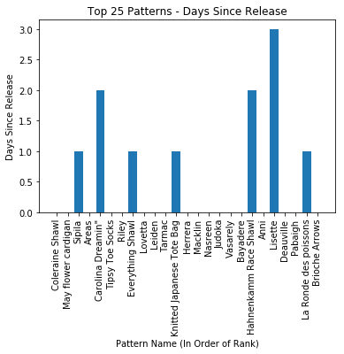
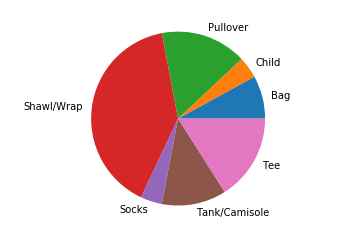

# An Introduction

Almost a year ago, I reached out to a couple people to get their blessing for a blogging project. Inspired by the old Stockinette Market post by Bristol Ivy, I wanted to start analyzing the hot right now patterns from Ravelry to see if I could find trends.

I've worked on it on and off for that year, but I kept trying to do too much at one time, then I would get too caught up in the weeds and then I would get overwhelmed and not actually publish anything because it wasn't going to be complete or perfect.

I'm trying to accept that I'm never going to have something that's complete or perfect.  I also need to spend more time practicing writing if I want to get better at it. So, I'm going to start here and see what this grows into.

## About the Data

This dataset was pulled from Ravelry on Friday, May 11 2018 at 14:41 UTC. This may not be a great dataset to start out with, because the new PomPom magazine came out in the last 24 hours, and the enthusiasm for their magazine has skewed the top 25 heavy towards their patterns.

## Types of Patterns
The Top 25 patterns were pulled for this data. 100% of the patterns were knitting patterns, which means there were no crochet or other patterns in the Top 25.

I think this makes sense, because my understanding is that knitters are in the majority on Ravelry.

## Days Since Release

The longest ago that a pattern in the Top 25 was released was 3 days ago. In fact, 72% of the patterns that are in the Top 25 are were released within the last 24 hours.

I don't have enough data in this dataset to know if this normal, but it's an area I plan to explore more in the future.

## Free vs. Paid Patterns

9 of the Top 25 patterns were free patterns, which is 36% of the patterns. I don't have a baseline to know if this is a normal number of free patterns, or if the numbers have been skewed by the PomPom release.  

## Pattern Downloadable

14 of the Top 25 patterns were downloadable, through either Ravelry or an external site. That means that 44% of the patterns are not available through download.

This number probably surprised me the most, as it seems really high. My gut says it's high because of the PomPom release, but it's something I'm going to examine more.

## Pattern Types

I went back and forth if I should include this in this post, because I'm really not happy with the presentation in this section. I'm working on getting a better chart, but this was the last piece holding me from posting.

The most popular patterns today were shawls/wraps, but when I aggregate the upper body garments (pullovers, tanks, camisoles and tees), they outnumber the shawls.

I want to add more attributes, and I'm going to spend more time looking at the how to present this effectively.

## Conclusion

There are some interesting insights here, but more work will need to be done to determine how the PomPom release impacted the data. I hope that with more work and practice this can create more impactful insights.
